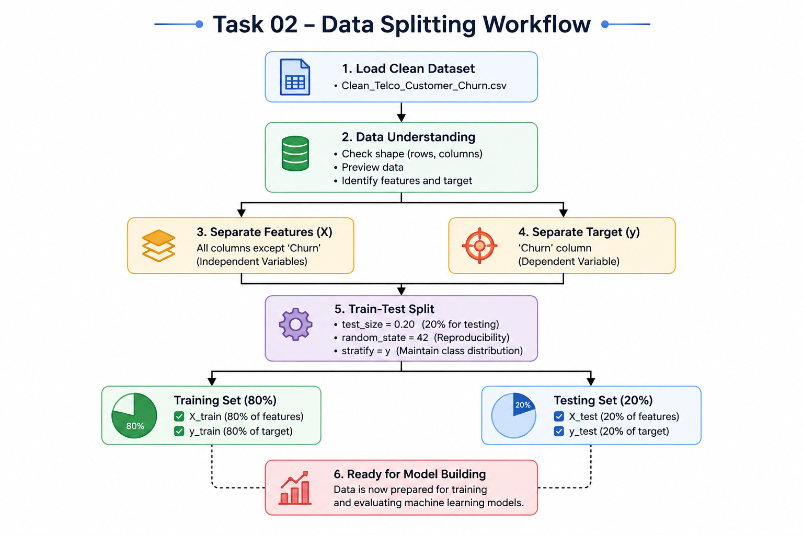
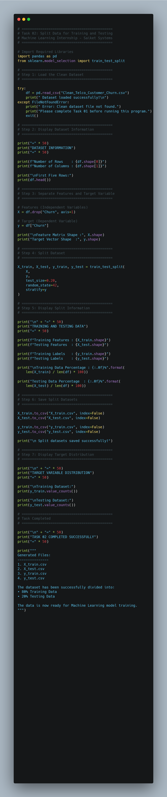
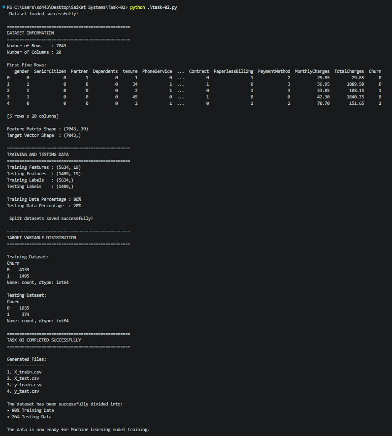

# 📊 Task 02 – Split Data for Training and Testing

<p align="center">


</p>

---

# 📌 Machine Learning Internship Project

**Organization:** Saiket Systems

**Role:** Machine Learning Intern

**Task:** Task 02 – Split Data for Training and Testing

---

# 📖 Overview

This project is the second task of my **Machine Learning Internship at Saiket Systems**.

The objective of this project is to divide a cleaned dataset into **Training (80%)** and **Testing (20%)** datasets using Scikit-learn's **train_test_split()** function.

A proper train-test split is one of the most important stages in the Machine Learning workflow because it allows the model to learn from one dataset while evaluating its performance on completely unseen data.

---

# 🎯 Objectives

- Load the cleaned Telco Customer Churn Dataset
- Separate Features (X) and Target Variable (y)
- Split the dataset into Training and Testing sets
- Maintain class balance using Stratified Sampling
- Save the generated datasets for future model training

---

# 🖼 Project Workflow

> The complete workflow of the Train-Test Split process.

<p align="center">

</p>

---

# 📸 Project Screenshots

## 💻 Python Code

<p align="center">

</p>

---

## 🖥 Program Output

<p align="center">

</p>

---

# 📂 Dataset Information

**Dataset:** Telco Customer Churn Dataset

This dataset contains customer information collected from a telecommunications company.

### Features include

- Gender
- Partner
- Dependents
- Internet Service
- Monthly Charges
- Contract
- Payment Method
- Tenure
- Senior Citizen
- Online Security
- Streaming Services
- Device Protection
- Tech Support

### 🎯 Target Variable

| Value | Description |
|-------|-------------|
| 1 | Customer Churned |
| 0 | Customer Stayed |

---

# 🛠 Technologies Used

- Python
- Pandas
- NumPy
- Scikit-learn

---

# 📚 Libraries

```python
import pandas as pd
from sklearn.model_selection import train_test_split
```

---

# 🔄 Machine Learning Pipeline

```text
Load Clean Dataset
        │
        ▼
Separate Features (X)
        │
        ▼
Separate Target (y)
        │
        ▼
Train-Test Split
(test_size = 0.20)
(random_state = 42)
(stratify = y)
        │
 ┌──────┴────────┐
 │               │
 ▼               ▼
Training      Testing
80%             20%
 │               │
 └──────┬────────┘
        ▼
Ready for Machine Learning Model
```

---

# ⚙️ Workflow Explanation

## Step 1 – Load Dataset

Load the cleaned dataset generated during Task 01 using the Pandas library.

---

## Step 2 – Explore Dataset

Inspect the dataset by checking:

- Number of rows
- Number of columns
- Dataset preview
- Feature count

---

## Step 3 – Separate Features and Target

### Features (X)

Independent variables used for prediction.

### Target (y)

The **Churn** column, which is the value to be predicted by the machine learning model.

---

## Step 4 – Split the Dataset

```python
X_train, X_test, y_train, y_test = train_test_split(
    X,
    y,
    test_size=0.20,
    random_state=42,
    stratify=y
)
```

### Parameter Explanation

### test_size = 0.20

- 80% Training Dataset
- 20% Testing Dataset

### random_state = 42

Ensures reproducible results by producing the same split every time the program runs.

### stratify = y

Maintains the same class distribution in both training and testing datasets.

---

# 📊 Output

| Dataset | Shape |
|---------|--------|
| X_train | (5634, 19) |
| X_test | (1409, 19) |
| y_train | (5634,) |
| y_test | (1409,) |

Generated Files:

- X_train.csv
- X_test.csv
- y_train.csv
- y_test.csv

---

# 📁 Project Structure

```text
Task-02/
│
├── images/
│   ├── workflow.png
│   ├── code.png
│   └── output.png
│
├── task-02.py
├── README.md
├── Clean_Telco_Customer_Churn.csv
├── X_train.csv
├── X_test.csv
├── y_train.csv
└── y_test.csv
```

---

# ▶️ Installation

```bash
git clone https://github.com/YourUsername/Task-02.git

cd Task-02

pip install pandas numpy scikit-learn
```

---

# ▶️ Run the Project

```bash
python task-02.py
```

---

# ✅ Expected Output

```text
Dataset loaded successfully!

Training Features : (5634, 19)
Testing Features  : (1409, 19)

Training Labels   : (5634,)
Testing Labels    : (1409,)

Training Data Percentage : 80%
Testing Data Percentage  : 20%

Task Completed Successfully
```

---

# 💡 Why Train-Test Split?

A Machine Learning model should never be evaluated using the same data on which it was trained.

Using a Train-Test Split helps to:

- Prevent Overfitting
- Measure Real-world Performance
- Improve Generalization
- Build Reliable Machine Learning Models

---

# 🚀 Skills Demonstrated

- Python Programming
- Data Analysis
- Data Preparation
- Pandas
- NumPy
- Scikit-learn
- Feature Engineering
- Train-Test Split
- Stratified Sampling
- Machine Learning Workflow

---

# 📚 Learning Outcomes

Through this project, I learned:

- Feature and Target Separation
- Data Splitting Methodology
- Importance of Training and Testing Datasets
- Reproducibility using random_state
- Maintaining Balanced Classes using stratify
- Preparing datasets for Machine Learning models

---

# 🚀 Future Scope

The generated datasets will be used in upcoming tasks for:

- Model Training
- Model Evaluation
- Classification Algorithms
- Customer Churn Prediction
- Performance Comparison

---

# 🙏 Acknowledgement

This project was completed as **Task 02** during my **Machine Learning Internship at Saiket Systems**. It provided valuable hands-on experience in one of the most fundamental stages of the Machine Learning pipeline.

---

# 👨‍💻 Author

**Shaikh Danish**

Machine Learning Intern | AI & ML Enthusiast

- 🌐 GitHub: https://github.com/YourUsername
- 💼 LinkedIn: https://linkedin.com/in/YourProfile

---

<p align="center">

⭐ If you found this project useful, consider giving it a **Star** on GitHub!

</p>
